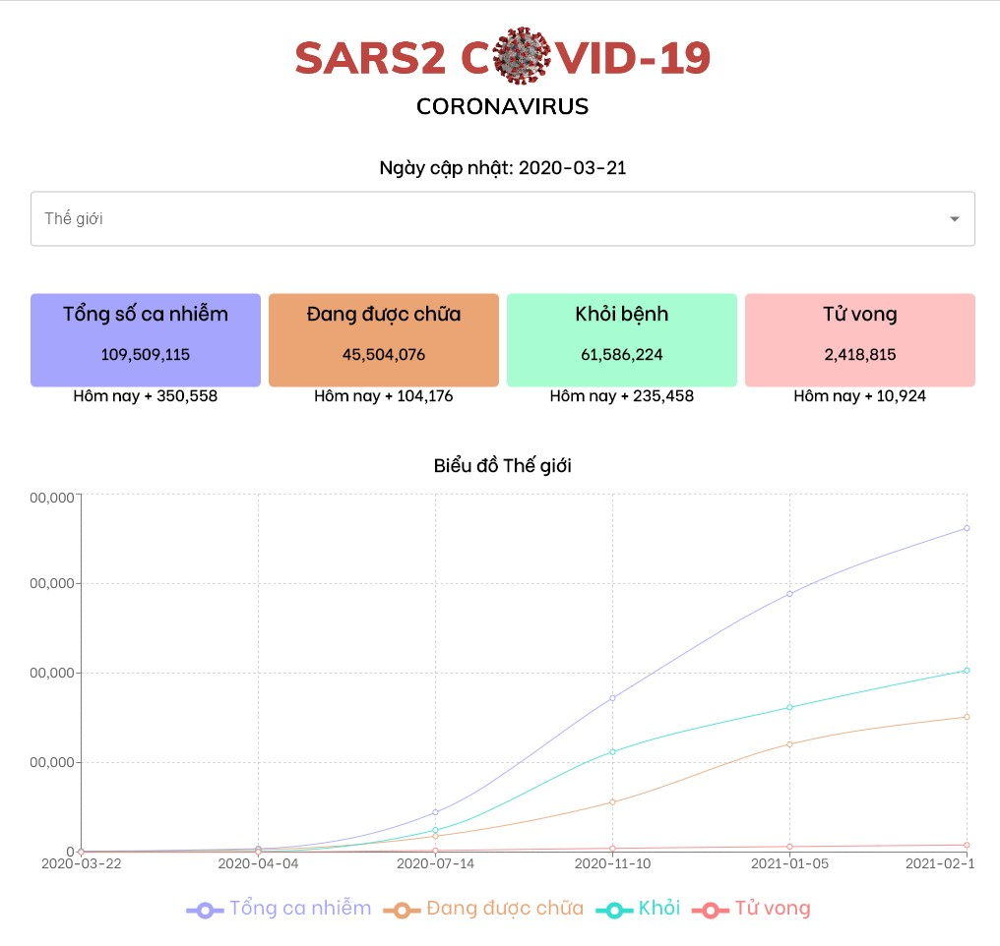
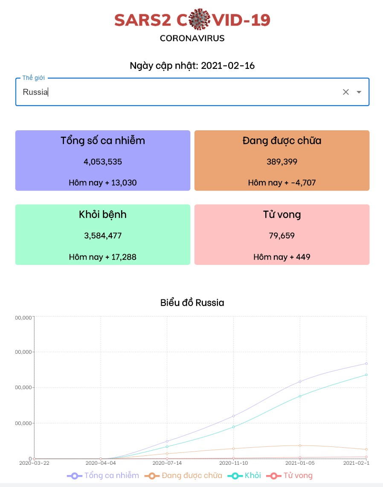
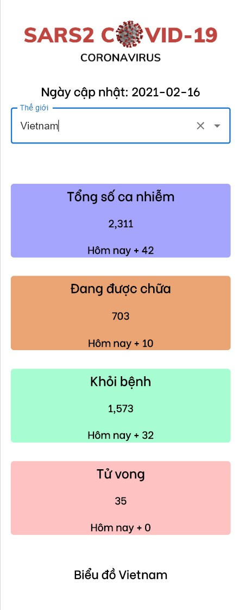

# Covid19 Tracker

### Live Demo
[https://example--create-react-app--examples--nort-kcwl.code.run](https://example--create-react-app--examples--nort-kcwl.code.run)

## Features
- Xem tổng số ca nhiễm, hồi phục và tử vong của từng nước và toàn thế giới.
- Biểu đồ tổng quát của từng nước và toàn thế giới từ lúc xuất hiện ca nhiễm đầu tiên đến thời điểm cập nhật gần nhất.

## Frameworks
- React
- Recharts
- MaterialUI

## Cloning this project into your local development 🚀
Set up your local development environment by following these steps:

1.  **Install packages.**

```bash
npm install
# or
yarn install
```

2.  **Start the development server.**

```bash
npm run start
# or
yarn run dev
```

The live development website should now appear at [http://localhost:5173](http://localhost:5173).

## Screenshots :camera:
- 🖥️


- 📟


- 📱
